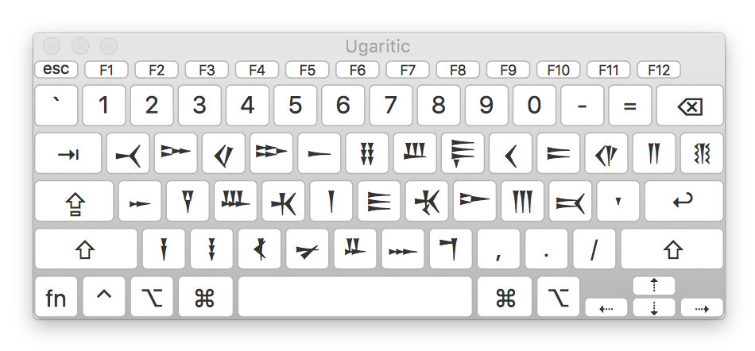

# Ugaritic Input Method
Unicode input methods for Ugaritic on Mac and Windows

# Key Mapping
The key mapping for the input method matches the letters of the Ugaritic alphabet with their transliterated equivalents on an English keyboard and tries to group remaining letters by similarity in sound.

# Fonts
There are several Unicode fonts available for Ugaritic. Google's Noto Sans Ugaritic is a good place to start:
https://www.google.com/get/noto/#sans-ugar

# Mac
- Download "Ugaritic.dmg" and mount the disk image
- Move "Ugaritic.keylayout" and "Ugaritic.icns" into "Keyboard Layouts"
- Open "System Preferences" -> "Keyboard" -> "Input Sources"
- Click the "+" to add a new input method and under "Others" choose "Ugaritic"

# Windows
- Download "Ugaritic.zip" and unzip the archive
- Run "setup.exe" to install
- For now at least, the input method installs as "English (United States) Ugaritic keyboard" as it has to attach to an existing Windows language
- You may need to log out and log back in after installing the input method
